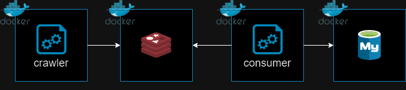

# REDIS CRAWLER

## Description

A simple crawling project that implements the write-behind architecture with Redis and MySql

## Architecture

## Tech Stack

## Todo list

- Deploy to AWS
- Manage server instances with Ansible
- Increase crawling scale
- Add elastic search and kafka
